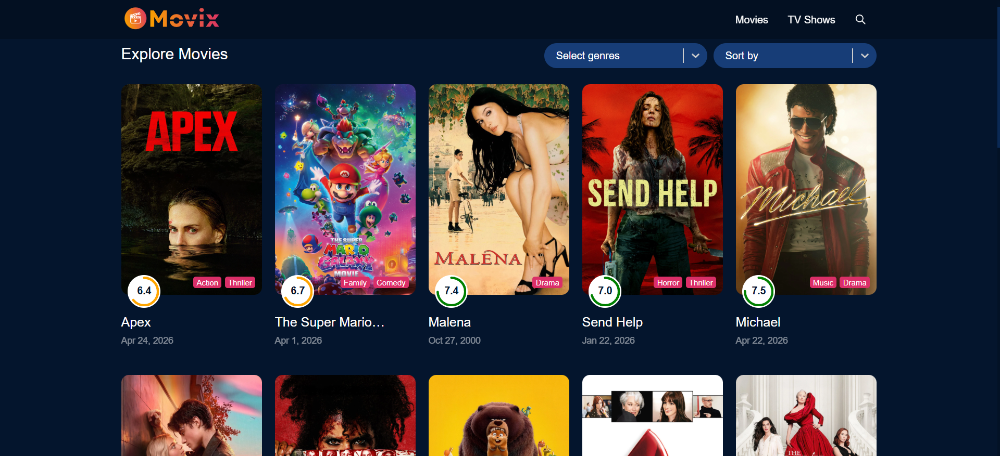

# Movix 🎬

A modern movie and TV show discovery app built with React — browse trending titles, explore by genre, watch trailers, and search across thousands of titles powered by the TMDB API.



---

## Features

- **Home** — Trending, Popular, and Top Rated sections with auto-rotating hero banner
- **Details** — Full movie/TV info: cast, videos, ratings, genres, runtime
- **Explore** — Filter by media type, genre, and sort order with infinite scroll
- **Search** — Real-time search across movies and TV shows
- **Trailers** — Watch trailers in a popup video player

---

## Tech Stack

| Layer | Technology |
|---|---|
| Framework | React 18 |
| Build Tool | Vite 5 |
| State Management | Redux Toolkit |
| Routing | React Router v6 |
| HTTP Client | Axios |
| Styling | SASS |
| Data Source | TMDB API |
| UI Libs | react-player, react-circular-progressbar, react-select, react-infinite-scroll-component, react-icons |

---

## Getting Started

### Prerequisites

- Node.js 18+
- A free [TMDB API](https://www.themoviedb.org/settings/api) account — you need the **Read Access Token** (Bearer token)

### 1. Clone the repo

```bash
git clone https://github.com/jayan92/react-movix.git
cd react-movix
```

### 2. Install dependencies

```bash
npm install
```

### 3. Configure environment

Create a `.env` file in the project root:

```env
VITE_APP_TMDB_TOKEN=your_tmdb_read_access_token_here
```

> Get your token from [TMDB → Settings → API](https://www.themoviedb.org/settings/api) under **API Read Access Token**.

### 4. Start the dev server

```bash
npm run dev
```

Open [http://localhost:5173](http://localhost:5173) in your browser.

---

## Available Scripts

| Command | Description |
|---|---|
| `npm run dev` | Start development server |
| `npm run build` | Build for production |
| `npm run preview` | Preview production build |
| `npm run lint` | Run ESLint |

---

## Project Structure

```
src/
├── components/        # Reusable UI components (Header, Footer, Carousel, etc.)
├── pages/
│   ├── home/          # Hero banner, Trending, Popular, Top Rated
│   ├── details/       # Movie/TV detail page with cast & videos
│   ├── explore/       # Browse with filters and infinite scroll
│   ├── searchResult/  # Search results page
│   └── 404/           # Not found page
├── hooks/             # useFetch custom hook
├── store/             # Redux store and homeSlice
└── utils/             # Axios API helper
```

---

## Environment Variables

| Variable | Description |
|---|---|
| `VITE_APP_TMDB_TOKEN` | TMDB API Read Access Token (Bearer) |

---

## License

MIT
